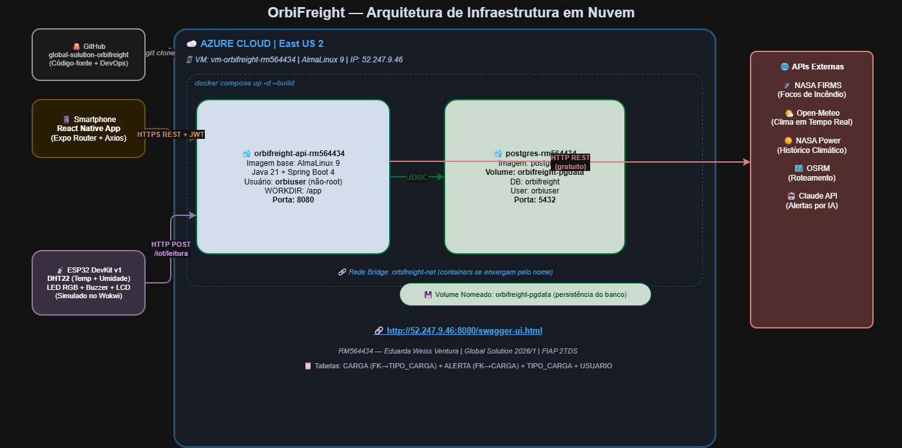

# 🛰️ OrbiFreight — Sistema de Monitoramento de Transporte Alimentício

> Plataforma inteligente de monitoramento de cargas perecíveis integrando **IoT (ESP32 + DHT22)**, **dados satelitais (NASA FIRMS, Open-Meteo)** e **IA (Claude API)** para detectar riscos de deterioração, sugerir rotas alternativas e emitir alertas automáticos.

**Global Solution 2026/1 · FIAP · 2TDS · Turmas de Fevereiro**

| Integrante | RM |
|---|---|
| **Eduarda Weiss Ventura** *(representante DevOps)* | **564434** |
| Maria Gabriela Landim Severo | 565146 |
| Samara Porto Souza | 559072 |
| Lucas Nunes Soares | 566503 |
| Camily Vitoria Pereira Maciel | 566520 |

---

## 💡 Descrição da Solução

O OrbiFreight resolve um problema crítico: **46 milhões de toneladas de alimentos são desperdiçadas no Brasil por ano**, sendo o transporte um dos principais fatores. Frotas de pequeno e médio porte não têm acesso a sistemas de monitoramento contínuos e acessíveis.

A solução inspira-se na tecnologia de sobrevivência de missões espaciais — os mesmos sistemas que garantem a integridade de suprimentos em Marte, aplicados na logística terrestre. O sistema:

- Coleta temperatura e umidade em tempo real via **sensor DHT22 no ESP32**
- Cruza os dados com **informações satelitais (NASA FIRMS para focos de incêndio, Open-Meteo para clima)**
- Calcula um **score de risco de 0 a 100** por carga
- Gera **alertas em linguagem natural via Claude API (Anthropic)**
- Sugere **rotas alternativas seguras via OSRM**
- Persiste tudo no banco com **rastreabilidade total para conformidade ANVISA**

---

## 🏗️ Arquitetura Macro



```
┌─────────────────────────────────────────────────────────────────────┐
│             AZURE CLOUD — East US 2                                  │
│   VM: vm-orbifreight-rm564434  |  AlmaLinux 9                       │
│                                                                       │
│   docker compose up -d --build                                       │
│   ┌────────────────────────┐     ┌───────────────────────────┐      │
│   │ orbifreight-api-       │     │ postgres-rm564434          │      │
│   │ rm564434               │◄────│ PostgreSQL 15              │      │
│   │ AlmaLinux 9 + Java 21  │JDBC │ Volume: orbifreight-pgdata │      │
│   │ Spring Boot 4          │     │ Porta: 5432                │      │
│   │ Usuário: orbiuser      │     └───────────────────────────┘      │
│   │ Porta: 8080            │                                         │
│   └────────────┬───────────┘                                         │
│   Rede bridge: orbifreight-net                                       │
└────────────────┼────────────────────────────────────────────────────┘
                 │ HTTP REST (gratuito)
    ┌────────────▼─────────────────────────────┐
    │ NASA FIRMS · Open-Meteo · NASA Power      │
    │ OSRM (Roteamento) · Claude API (IA)       │
    └──────────────────────────────────────────┘
         ▲ HTTPS REST + JWT
┌────────┴──────┐    ┌─────────────────────┐
│ React Native  │    │ ESP32 IoT (DHT22)   │
│ Mobile App    │    │ HTTP POST /iot       │
└───────────────┘    └─────────────────────┘
```

**Tabelas relacionadas:** `TIPO_CARGA` ← `CARGA` ← `ALERTA` ← `USUARIO`

---

## 📋 Pré-requisitos

- Conta [Azure](https://portal.azure.com) (conta estudante FIAP)
- Terminal com acesso ao [Azure Cloud Shell](https://shell.azure.com) ou Azure CLI instalado
- Git instalado no seu PC

---

## 🚀 How-to — Do clone ao ambiente em nuvem

### ETAPA 1 — Clonar o repositório

```bash
git clone https://github.com/eduardawv/global-solution-orbifreight.git
cd global-solution-orbifreight
```

### ETAPA 2 — Criar a VM AlmaLinux no Azure

Abra o [Azure Cloud Shell](https://shell.azure.com) (bash), faça upload do arquivo `criar-vm-azure.sh` e execute:

```bash
chmod +x criar-vm-azure.sh
./criar-vm-azure.sh
```

O script cria automaticamente:
- Resource Group `rg-orbifreight`
- VM `vm-orbifreight-rm564434` (AlmaLinux 9, Standard_D2s_v5)
- Portas 22 (SSH) e 8080 (API) abertas

Ao final mostra o **IP público** — anote.

### ETAPA 3 — Conectar na VM via SSH

```bash
ssh azureuser@SEU_IP_PUBLICO
```
Senha: `OrbiFreight.GS.2026`

### ETAPA 4 — Instalar Docker na VM

```bash
# Dentro da VM:
git clone https://github.com/eduardawv/global-solution-orbifreight.git
cd global-solution-orbifreight
chmod +x vm-setup-almalinux.sh
./vm-setup-almalinux.sh
```

Saia e reconecte (necessário para o Docker funcionar sem sudo):
```bash
exit
ssh azureuser@SEU_IP_PUBLICO
cd global-solution-orbifreight
```

### ETAPA 5 — Subir os containers

```bash
cp .env.example .env
docker compose up -d --build
```

Aguarde 3–5 minutos na primeira vez (Maven compila + monta imagem AlmaLinux).

### ETAPA 6 — Verificar e acessar

```bash
docker ps
```

Acesse no navegador:
```
http://SEU_IP_PUBLICO:8080/swagger-ui.html
```

---

## 🔍 Evidências Obrigatórias

### Logs dos containers
```bash
docker logs orbifreight-api-rm564434
docker logs postgres-rm564434
```

### Acesso ao container Java
```bash
docker exec -it orbifreight-api-rm564434 bash
whoami   # orbiuser
pwd      # /app
ls -l    # app.jar
exit
```

### Acesso ao container banco
```bash
docker exec -it postgres-rm564434 bash
whoami
pwd
ls -l /var/lib/postgresql/data
exit
```

---

## 🧪 CRUD Completo (via curl)

```bash
# Criar conta
curl -s -X POST http://localhost:8080/auth/register \
  -H "Content-Type: application/json" \
  -d '{"nome":"Eduarda","email":"eduarda@orbi.com","senha":"senha123","cargo":"GESTOR"}'

# Login + capturar token
TOKEN=$(curl -s -X POST http://localhost:8080/auth/login \
  -H "Content-Type: application/json" \
  -d '{"email":"eduarda@orbi.com","senha":"senha123"}' \
  | python3 -c "import sys,json; print(json.load(sys.stdin)['token'])")

# CREATE — Tipo de Carga
curl -s -X POST http://localhost:8080/tipos-carga \
  -H "Authorization: Bearer $TOKEN" -H "Content-Type: application/json" \
  -d '{"nome":"Carne Bovina","tempMin":0,"tempMax":4,"umidadeMax":90,"prazoMaxHoras":48}'

# CREATE — Carga
curl -s -X POST http://localhost:8080/cargas \
  -H "Authorization: Bearer $TOKEN" -H "Content-Type: application/json" \
  -d '{"tipoId":1,"veiculoId":1,"motoristaId":1,"placaVeiculo":"ABC1D234","origem":"Sao Paulo SP","destino":"Campinas SP","tempMin":0,"tempMax":4,"umidadeMax":90,"status":"ATIVA"}'

# CREATE — Alerta
curl -s -X POST http://localhost:8080/alertas \
  -H "Authorization: Bearer $TOKEN" -H "Content-Type: application/json" \
  -d '{"cargaId":1,"titulo":"Temperatura critica","descricao":"Sensor IoT registrou 6.5C acima do limite","nivel":"CRITICO","status":"ABERTO"}'

# READ
curl -s http://localhost:8080/cargas -H "Authorization: Bearer $TOKEN"
curl -s http://localhost:8080/alertas -H "Authorization: Bearer $TOKEN"

# UPDATE
curl -s -X PUT http://localhost:8080/cargas/1 \
  -H "Authorization: Bearer $TOKEN" -H "Content-Type: application/json" \
  -d '{"tipoId":1,"veiculoId":1,"motoristaId":1,"placaVeiculo":"ABC1D234","origem":"Sao Paulo SP","destino":"Ribeirao Preto SP","tempMin":0,"tempMax":4,"umidadeMax":90,"status":"ATIVA"}'

# DELETE
curl -s -X DELETE http://localhost:8080/cargas/1 -H "Authorization: Bearer $TOKEN"
```

---

## 🗄️ SELECT no Banco — Evidência de Persistência e Relacionamento

```bash
# Estrutura das tabelas (mostra Foreign Keys)
docker exec -it postgres-rm564434 psql -U orbiuser -d orbifreight -c "\d carga"
docker exec -it postgres-rm564434 psql -U orbiuser -d orbifreight -c "\d alerta"

# SELECT simples por tabela
docker exec -it postgres-rm564434 psql -U orbiuser -d orbifreight -c "SELECT * FROM tipo_carga;"
docker exec -it postgres-rm564434 psql -U orbiuser -d orbifreight -c "SELECT id, placa_veiculo, status FROM carga;"
docker exec -it postgres-rm564434 psql -U orbiuser -d orbifreight -c "SELECT id, carga_id, titulo, nivel FROM alerta;"

# JOIN — prova o relacionamento entre as 3 tabelas
docker exec -it postgres-rm564434 psql -U orbiuser -d orbifreight -c "
SELECT c.id AS carga_id, c.placa_veiculo, tc.nome AS tipo_de_carga,
       c.status, a.titulo AS alerta, a.nivel
FROM carga c
JOIN tipo_carga tc ON tc.id = c.tipo_id
JOIN alerta     a  ON a.carga_id = c.id;"
```

---

## ✅ Checklist de Requisitos

| Requisito | Status |
|---|---|
| Dockerfile com AlmaLinux 9 personalizado | ✅ |
| Usuário não-root: orbiuser | ✅ |
| WORKDIR definido: /app | ✅ |
| Variável de ambiente no App | ✅ |
| Porta 8080 exposta | ✅ |
| Nome container App com RM564434 | ✅ |
| CRUD completo + 2 tabelas relacionadas | ✅ |
| Volume nomeado: orbifreight-pgdata | ✅ |
| Variável de ambiente no banco | ✅ |
| Porta 5432 exposta | ✅ |
| Nome container banco com RM564434 | ✅ |
| Rede bridge compartilhada | ✅ |
| Execução em background (-d) | ✅ |
| Solução em nuvem — VM Azure com IP público | ✅ |

---

*OrbiFreight · Global Solution 2026/1 · FIAP 2TDS · VM AlmaLinux 9 · RM564434*
